<h3><code>khadim@github ~ $ whoami</code></h3>

<table>
<tr>
<td valign="top"></td>
<td valign="top"></td>
</tr>
</table>

 
 

<h3><code>khadim@github ~ $ ./contributions.sh</code></h3>

 
 

<h3><code>khadim@github ~ $ ./stats.sh</code></h3>

 
 

<h3><code>khadim@github ~ $ ./stack.sh</code></h3>

 
 

<h3><code>khadim@github ~ $ ./links.sh</code></h3>

 

<a href="mailto:khadimmbaye@esp.sn"><code>khadimmbaye@esp.sn</code></a>

 

